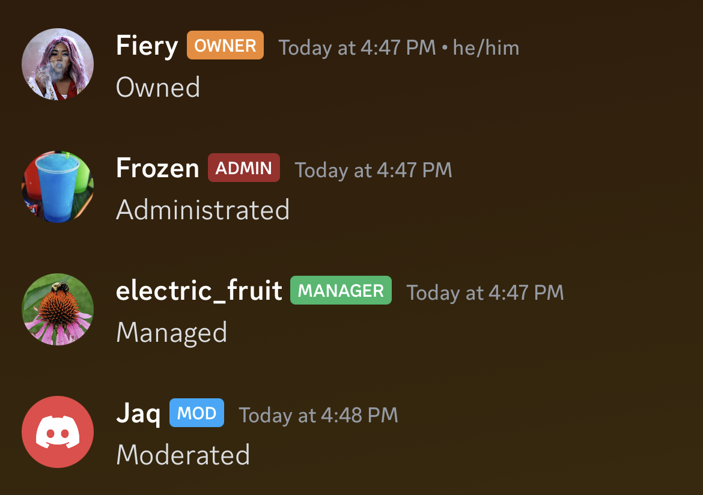

# Staff Tags

Shows tags for staff members in chat.

Currently shows the following:

- Owner
- Administrator (Based on if the member has the `ADMINISTRATOR` permission)
- Manager (Based on if the member has any of the following permissions: `MANAGE_GUILD`, `MANAGE_CHANNELS`, `MANAGE_ROLES`, `MANAGE_WEBHOOKS`)
- Moderator (Based on if the member has any of the following permissions: `MANAGE_MESSAGES`, `KICK_MEMBERS`, `BAN_MEMBERS`)

The tags can be themed, as they just use Discord colors:

- Owner (`ORANGE_345`)
- Administrator (`RED_560`)
- Manager (`GREEN_345`)
- Moderator (`BLUE_345`)
